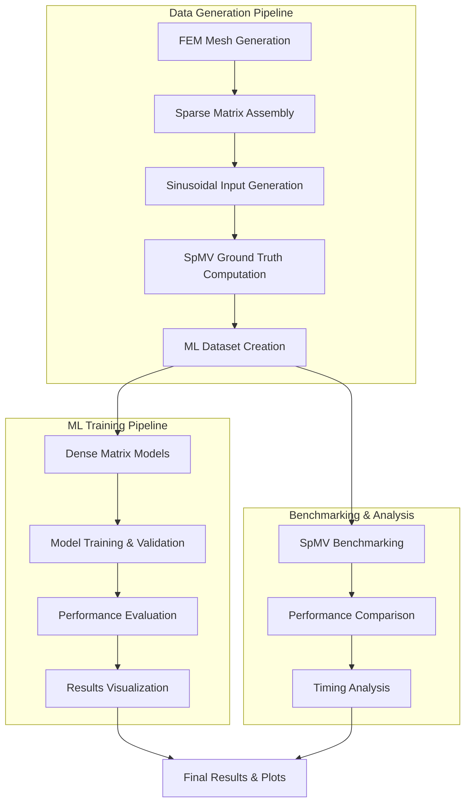
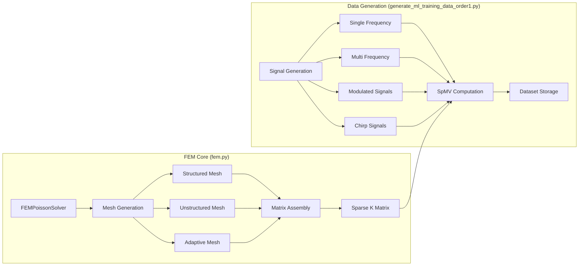
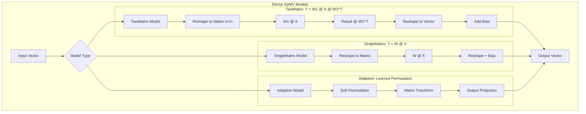
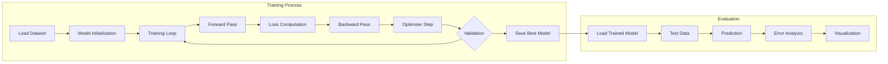
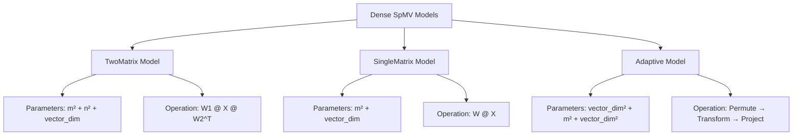
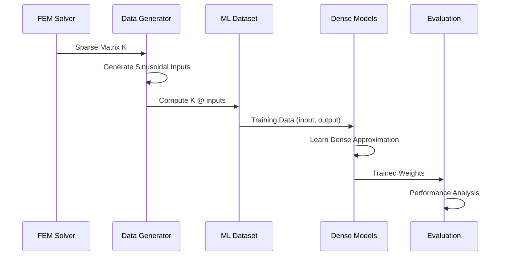

# Architecture Diagram: SpMV-CNN2D-SparseMatrices-nonorm

## System Overview

## Detailed Component Architecture

### 1. FEM Data Generation Layer

### 2. ML Model Architecture

### 3. Training & Evaluation Pipeline

## File Structure & Responsibilities

### Core Components
- **`fem.py`** (53KB, 1325 lines)
  - FEMPoissonSolver class
  - Mesh generation (structured/unstructured/adaptive)
  - Sparse matrix assembly
  - Boundary condition handling

- **`generate_ml_training_data_order1.py`** (34KB, 861 lines)
  - Sinusoidal signal generation
  - Multiple frequency combinations
  - Dataset creation and storage
  - Visualization utilities

- **`train_dense_spmv.py`** (16KB, 455 lines)
  - Dense matrix model definitions
  - Training pipeline
  - Validation and testing
  - Result saving

### Model Variants

### Data Flow

## Key Features

### 1. Matrix Reshaping Strategy
- **Problem**: Sparse matrix-vector multiplication → Dense matrix-matrix multiplication
- **Solution**: Reshape vector to matrix, apply dense operations, reshape back
- **Benefits**: GPU efficiency, parallelizable operations

### 2. Multiple Model Architectures
- **TwoMatrix**: Most expressive, highest parameter count
- **SingleMatrix**: Parameter efficient, good performance
- **Adaptive**: Learned optimal reshaping via soft permutation

### 3. Comprehensive Evaluation
- **In-distribution**: Same frequency ranges as training
- **Out-of-distribution**: Higher frequencies for generalization testing
- **Metrics**: MSE, RMSE, relative error, parameter efficiency

### 4. Visualization Pipeline
- **Training curves**: Loss progression, validation metrics
- **Field comparisons**: Ground truth vs predictions
- **Error analysis**: Spatial error distribution
- **Performance plots**: Speed vs accuracy tradeoffs

## Current State (Sept 13, 2025)
- **Latest Results**: `dense_spmv_results_20250913_135903/`
- **Active Models**: Multiple TwoMatrix configurations (16×89, 8×178, 4×356, 2×712)
- **Dataset**: Order-1 FEM with 1500 mixed sinusoidal samples
- **Evaluation**: Both in-distribution and out-of-distribution testing complete

This architecture represents a novel approach to learning sparse matrix-vector multiplication through dense matrix approximations, leveraging GPU efficiency while maintaining high accuracy for FEM applications.

